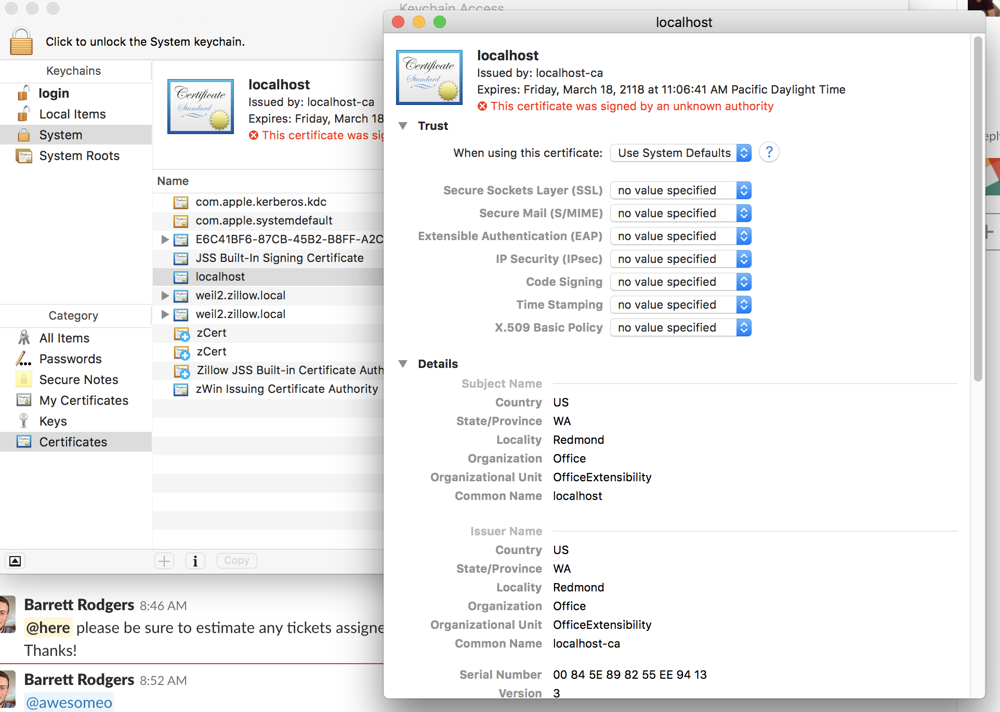

Sheety Dev Guide
==============
The project is bootstrapped form [Microsoft official guide for Office add ins](https://docs.microsoft.com/en-us/office/dev/add-ins/quickstarts/excel-quickstart-angular)

The Microsoft official documentation is a bit out of date. You do not need to copy and paste the certificate files (yeoman generator now will automatically do that for you). You still need to manually add the certificate file to your mac keychain, by following instructions linked in [office yoeman generator](https://github.com/OfficeDev/generator-office)

# Security concerns #
Adding an adhoc certificate to your keychain poses a security threat. You should rmemeber to disable it whenever appropriate through Mac Keychain Access tool:

